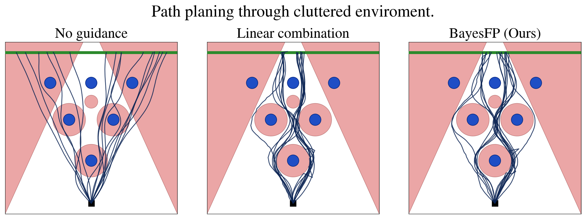

# BayesFP

Code accompanying **BayesFP: Posterior Estimation for Flow-Based Policies via Feynman-Kac Sampling**, by Sreevardhan Sirigiri, Weiming Zhi, and Fabio Ramos.

BayesFP adds inference-time costs and constraints to pretrained diffusion and flow-matching policies without retraining the base policy. It treats the policy as a prior and uses Feynman-Kac weighted sampling to favor trajectories with lower cost. In the code, the method is usually called `fkc` (Feynman-Kac corrector).



## Experiments and run guides

| Experiment | Code | Run guide |
| --- | --- | --- |
| LIBERO-Object with GR00T-N1.6: cylindrical and non-convex obstacles | `src/Isaac-GR00T` | [LIBERO + GR00T](docs/libero-gr00t.md) |
| RoboLab with pi0.5: joint-position actions and online scene SDF guidance | `src/RoboLab`, `src/openpi` | [RoboLab + pi0.5](docs/robolab-pi05.md) |
| RoboMimic Can and Transport with Diffusion Policy: cylindrical obstacles | `src/diffusion_policy` | [Diffusion Policy](docs/diffusion-policy.md) |
| 2D trajectory diffusion: cluttered and non-convex obstacle examples | `src/ToyExamples` | [Toy examples](docs/toy-examples.md) |

Each guide covers prerequisites, the working directory, baseline and guided evaluation, configuration, and output files. Start with the toy examples to try the method without a robot simulator.

## Get the code

This repository includes modified policy and simulator repositories as Git submodules. Use the versions recorded by BayesFP so that the guidance code and evaluation interfaces match.

```bash
git clone --recurse-submodules git@github.com:S-sirigiri/BayesFP.git
cd BayesFP
```

For an existing clone:

```bash
git submodule update --init --recursive
```

The submodule URLs in [`.gitmodules`](.gitmodules) include GitHub SSH URLs, so this checkout requires GitHub SSH access. Keep the pinned submodule revisions when reproducing experiments; updating to upstream `main` may change the model or simulator APIs.

## Install and set up the environments

Follow the installation instructions in the corresponding repositories below. They are the source of truth for dependencies, Python/CUDA versions, simulator installation, and hardware requirements. Use the checked-out forks under `src/` when following them.

| Component | Installation and setup instructions |
| --- | --- |
| GR00T-N1.6 | [GR00T installation guide](src/Isaac-GR00T/README.md#installation-guide) and [LIBERO example setup/data preparation](src/Isaac-GR00T/examples/LIBERO/README.md) |
| RoboLab / Isaac Lab | [RoboLab installation](src/RoboLab/README.md#installation) and [requirements](src/RoboLab/README.md#requirements) |
| pi0.5 policy server | [openpi installation](src/openpi/README.md#installation) and [requirements](src/openpi/README.md#requirements) |
| Online SDF backend for RoboLab | [SDF prerequisites in the RoboLab guide](docs/robolab-pi05.md#environment-setup-and-checkpoint) |
| Diffusion Policy / RoboMimic | [Diffusion Policy installation](src/diffusion_policy/README.md) and [simulation environment specification](src/diffusion_policy/conda_environment.yaml) |
| Both toy examples | [Toy environment setup](src/ToyExamples/triangle_obstacles_2d/README.md#setup) and [environment specification](src/ToyExamples/triangle_obstacles_2d/environment.yml) |

Use separate environments for these stacks. The GR00T and pi0.5 experiments run a model server and a simulator client in separate terminals; activate the appropriate environment in each terminal. There is no single root-level environment that installs all experiments.

## Quick start: 2D toy examples

After following the [toy environment setup](src/ToyExamples/triangle_obstacles_2d/README.md#setup), run these commands from the BayesFP root:

```bash
# Cluttered environment: train, then compare all three samplers.
python -m src.ToyExamples.triangle_obstacles_2d.train
python -m src.ToyExamples.triangle_obstacles_2d.infer \
  --scenario cluttered --num_samples 16 --seed 0

# Non-convex obstacle: train a separate model, then compare samplers.
python -m src.ToyExamples.square_obstacle_2d.train
python -m src.ToyExamples.square_obstacle_2d.infer \
  --scenario inverted_c --num_samples 16 --seed 0
```

Training creates `checkpoints/latest.pt` under the corresponding toy directory. Inference writes three-panel PNG/PDF figures under its `results/` directory and prints collision, constraint-violation, and goal-reaching metrics. See the [toy guide](docs/toy-examples.md) for other scenarios, checkpoint selection, and configuration details.

## Checkpoints and reproducibility

Robot experiments require compatible pretrained checkpoints and simulator assets. The run guides identify the expected model/configuration pairs and dataset locations. Machine-local files under `tmp/`, ignored model/data directories, and generated checkpoints should not be assumed to be available in a fresh clone. The GR00T LIBERO-Object checkpoint used in the paper has no public download location documented in this checkout; the [GR00T guide](docs/libero-gr00t.md) links the existing fine-tuning workflow.

The examples are starting points for running the current code. Some shipped configurations are placeholders or use different defaults from the paper. For a comparison, keep the checkpoint, task, obstacle geometry, initial states/seeds, and rollout budget fixed, and change only the sampler settings. Save the actual guidance configuration alongside each run, especially for configurations that reload while a server is running.

For the robotic experiments, the paper uses 32 particles for Diffusion Policy, 8 for GR00T-N1.6, and 4 for pi0.5, with an active interval of `[0.05, 0.95]`. The toy defaults differ. Collision metrics also differ between stacks; consult each guide before comparing their values. The guides cover the simulation and toy entry points present in this checkout; the paper's SO101 hardware experiments need a separate deployment setup.

## Citation

If you use this code in your research, please cite the accompanying manuscript. This entry records the manuscript metadata; use the final publication entry when available.

```bibtex
@misc{sirigiri2026bayesfp,
  title  = {BayesFP: Posterior Estimation for Flow-Based Policies via Feynman-Kac Sampling},
  author = {Sirigiri, Sreevardhan and Zhi, Weiming and Ramos, Fabio},
  year   = {2026}
}
```

Please also cite the policies and benchmarks used in your experiments, following their respective READMEs.

## Acknowledgements and licenses

This project builds on [Isaac GR00T](https://github.com/NVIDIA/Isaac-GR00T), [openpi](https://github.com/Physical-Intelligence/openpi), [RoboLab](https://github.com/NVlabs/RoboLab), [Diffusion Policy](https://github.com/real-stanford/diffusion_policy), LIBERO, and RoboMimic. The cluttered toy geometry is adapted from the JM2D example described in its [local README](src/ToyExamples/triangle_obstacles_2d/README.md).

Third-party code retains its own license: [GR00T](src/Isaac-GR00T/LICENSE), [openpi](src/openpi/LICENSE), [RoboLab](src/RoboLab/LICENSE), and [Diffusion Policy](src/diffusion_policy/LICENSE). Model weights and datasets may have separate terms in their source repositories. A license for the root BayesFP code has not yet been declared in this checkout.

For bug reports and documentation contributions, see [CONTRIBUTING.md](CONTRIBUTING.md).
